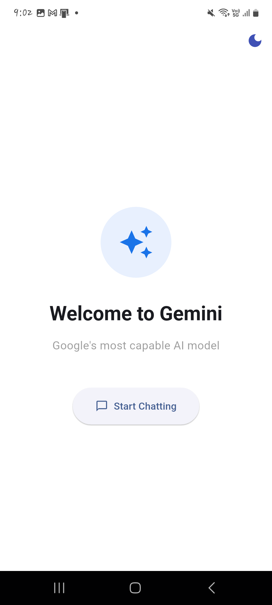
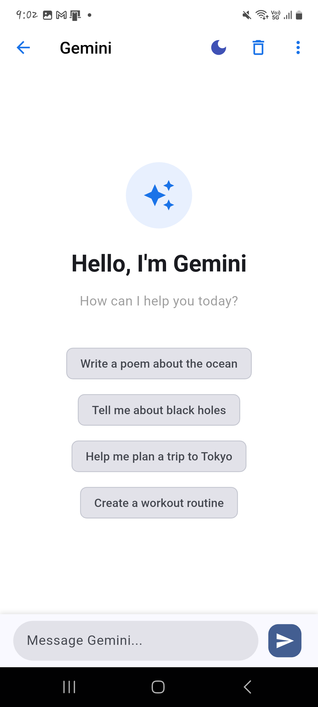
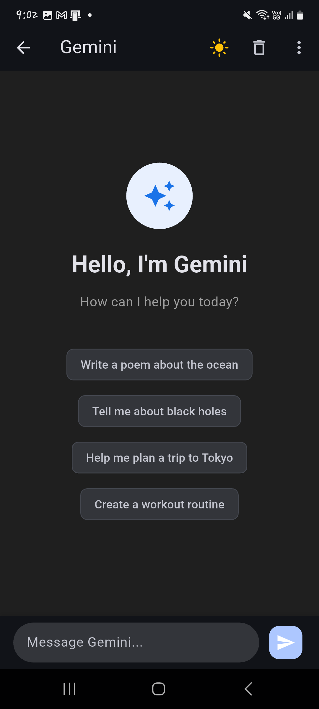
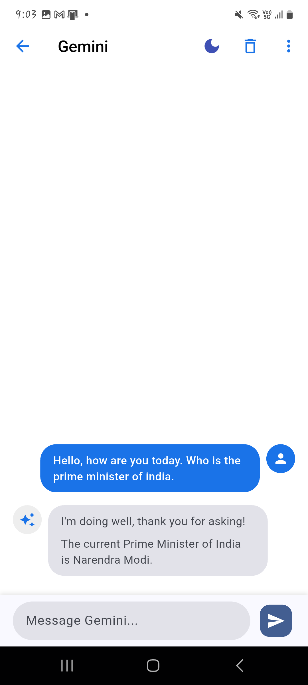
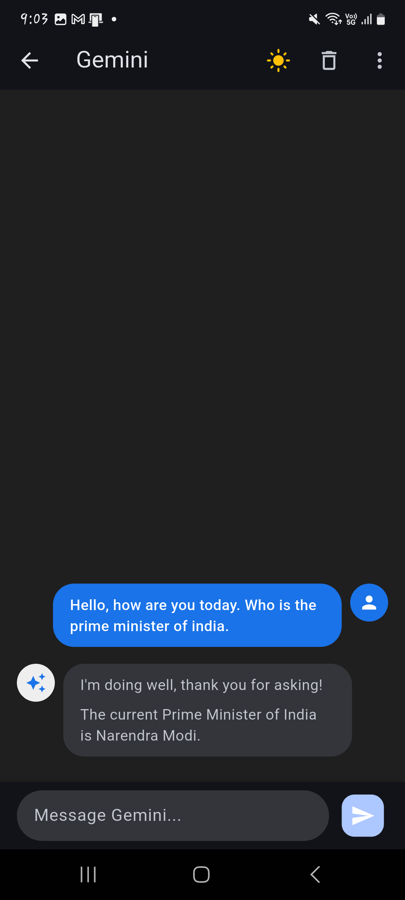

# 💬 Gemini Chat App with Flutter

A beautiful and functional Flutter application that integrates the Gemini API for AI-powered conversations. This app features a sleek user interface, light/dark mode support, and seamless state management using the GetX package.

---

## ✨ Features

- 🔮 Chat with Gemini (Google's Generative AI)
- 🌗 Light and Dark Theme support
- 🎯 Clean UI with modern design
- ⚙️ GetX for state management and routing
- 💾 Persistent chat data using Shared Preferences
- 🧩 Markdown support in chat responses

---

## 📸 Screenshots

| Light Mode | Dark Mode |
|------------|-----------|
|  |  |  |   |   |   |

---

## 🧰 Packages Used

| Package | Description |
|--------|-------------|
| [`google_generative_ai`](https://pub.dev/packages/google_generative_ai) | Gemini API integration |
| [`http`](https://pub.dev/packages/http) | API communication |
| [`flutter_markdown`](https://pub.dev/packages/flutter_markdown) | Markdown rendering |
| [`get`](https://pub.dev/packages/get) | State management and navigation |
| [`shared_preferences`](https://pub.dev/packages/shared_preferences) | Persistent local storage |
| [`cupertino_icons`](https://pub.dev/packages/cupertino_icons) | iOS-style icons |

---

## 🚀 Getting Started

### 1. Clone the Repository

```bash
git clone https://github.com/your-username/gemini-chat-flutter.git
cd gemini-chat-flutter
flutter pub get
